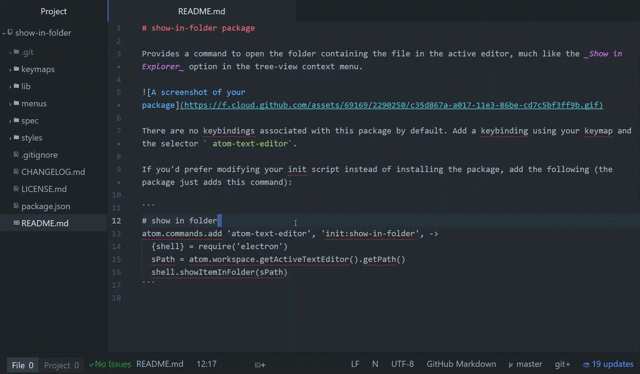

# Show In Folder

An [Atom](http://atom.io) package.

Provides a command to open the folder containing the file in the active editor, much like the _Show in Explorer_ option in the tree-view context menu.



There are no keybindings associated with this package by default. Add a keybinding using your keymap and the selector ` atom-text-editor`.

If you'd prefer modifying your init script instead of installing the package, add the following (the package just adds this command):

```
# show in folder
atom.commands.add 'atom-text-editor', 'init:show-in-folder', ->
  {shell} = require('electron')
  sPath = atom.workspace.getActiveTextEditor().getPath()
  shell.showItemInFolder(sPath)
```
